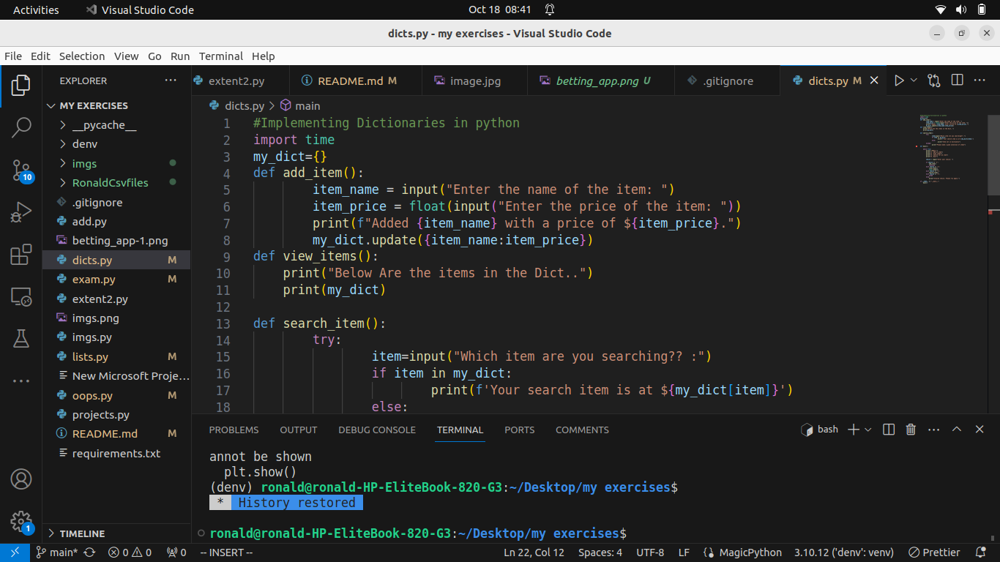
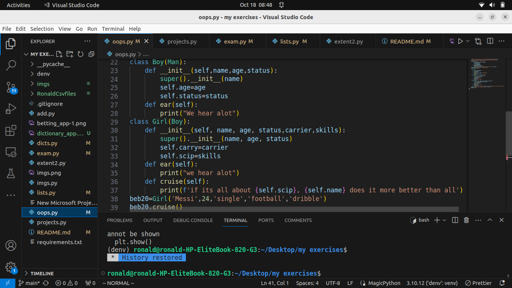
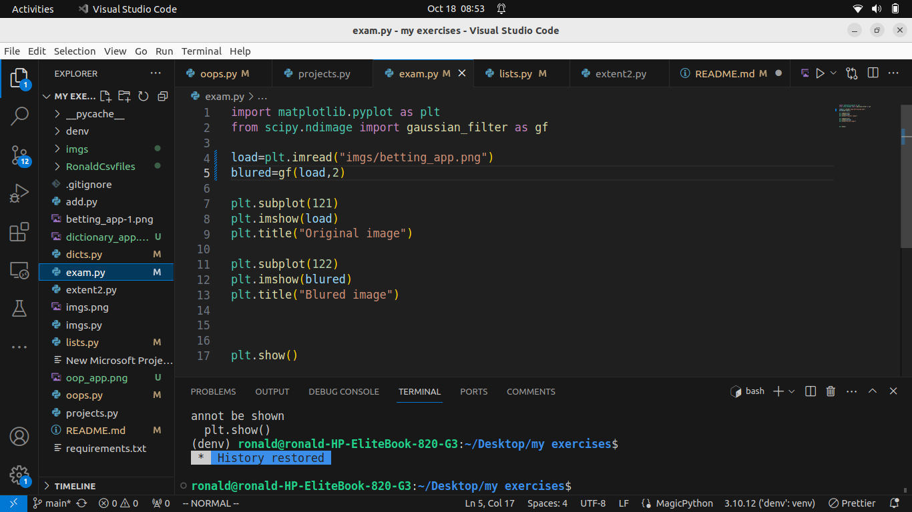
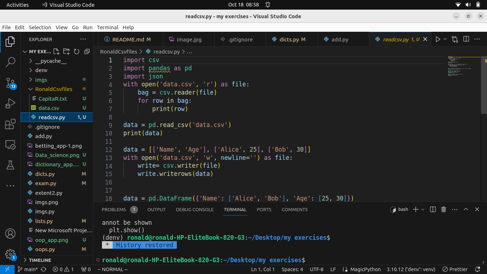

## My applications
### App1: Betting application (filename: extent2.py)
- This betting application basically asks users to bet among various games being played across Europe and some other games Across the world, e.g soccer, basketball, netball and rugby

### App2: Dictionary application(filename: dicts.py)
- This application basically allows users to interfere with dictionaries in python,e.g udating them,displaying and maybe search for any item in the dictionary

### App3: Object Oriented programming App(filename: oops.py)
- This app shows how we can interact around classes and class methods by using most of oop principles and later instantiating objects to different data

### App4: Data Science App(filename: exams.py)
- This is a data science app which uses python libraries like matplotlib and scipy which plots two images one blured and the other normal

### App5: Csv App(filename: readcsv.py)
- This application also allows us read from the csv file as instructed and also writes to any csv file as specified to it.

